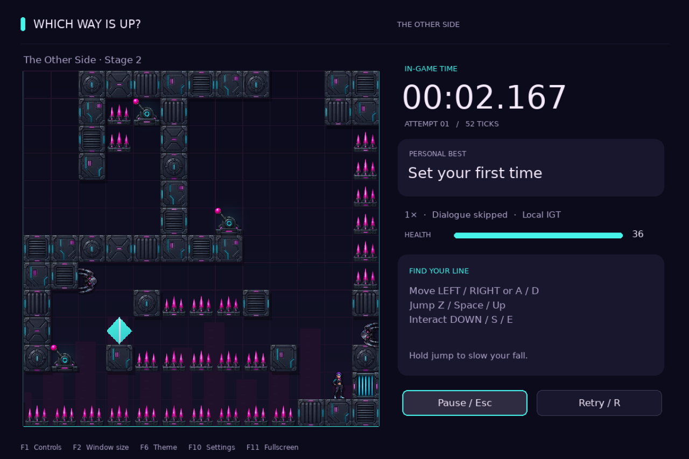

# Which Way Is Up? — Refresh

**Turn the world. Find your way through.**

A free Linux puzzle-platformer with 15 stages, five visual themes, local best times,
and a stage editor. This is Mohtab Arabiat’s independent refresh of
Olli “Hectigo” Etuaho’s 2007 game—the first game Mohtab played on Linux.



## Download and play

**[Download the Linux preview](https://github.com/mohtab/whichwayisup-refresh/releases)**

Choose the **0.4.0rc4** release and open its **Assets** list:

| Your system | Download | Next step |
| --- | --- | --- |
| Arch Linux or Omarchy | `whichwayisup-refresh-0.4.0rc4-1-any.pkg.tar.zst` | Install with the command below |
| Other Linux distributions | `whichwayisup-refresh-0.4.0rc4.tar.gz` | Follow the [Linux install guide](docs/INSTALL.md#other-linux-desktops-run-from-the-archive) |

On Arch or Omarchy, open a terminal in the folder containing your download:

```sh
sudo pacman -U ./whichwayisup-refresh-0.4.0rc4-1-any.pkg.tar.zst
```

Then open **Which Way Is Up? — Refresh** from your application menu.

The source download needs **Python 3.11 or newer** and **Pygame 2.6**. The install
guide walks through setup; you do not need Git. Windows and macOS installers are
not available for this preview.

This is a **preview release**. Feedback is welcome, especially on controllers,
audio, and different display setups. See [what changed](CHANGELOG.md).

## Your first game

Choose **Play**, follow the first stage’s hints, and collect or interact with objects
to discover how each room works. Use **Continue** to return to your next unfinished
stage. Completed stages and settings save automatically.

| Action | Keys |
| --- | --- |
| Move | ← / → or A / D |
| Jump | Z, Space, or ↑ |
| Fall more slowly | Hold jump |
| Pick up an item or use a lever | ↓, S, or E |
| Pause | Esc |
| Retry the stage | R |
| Show all controls | F1 |
| Open settings | F10 |
| Fullscreen | F11, then Enter to confirm |

**[Read the player guide](docs/PLAYER_GUIDE.md)** for controllers, remapping,
saves, and the stage editor.

## Make it yours

- **Five looks:** Original, Refresh, Omarchy, Follow Omarchy, and Cyberpunk.
- **A view that fits:** full interface, compact HUD, or a larger board-only view.
- **Comfort options:** reduced effects, optional high-contrast sprite outlines,
  adjustable music and sound, and remappable movement keys.
- **Play at your pace:** keep the story dialogue or skip it, adjust tempo, and
  chase your own best times. Records stay on your computer.
- **Build a room:** create, playtest, and share stages as files with the stage studio.

Find these options under **Customize**. Press **F6** to try another theme.
The original stages and movement rules remain the foundation of every theme.

## Need a hand?

- [Installation and troubleshooting](docs/INSTALL.md)
- [Player guide](docs/PLAYER_GUIDE.md)
- [Report a bug](https://github.com/mohtab/whichwayisup-refresh/issues/new?template=bug_report.yml)
- [Suggest an improvement](https://github.com/mohtab/whichwayisup-refresh/issues/new?template=feature_request.yml)

When reporting a problem, include your game version, Linux distribution, and what
happened. A screenshot is helpful for visual issues.

## Credits and contributions

Original game by **Olli “Hectigo” Etuaho**. Refresh direction and maintenance by
**Mohtab Arabiat**, with **AI coding assistance from Codex (OpenAI)**. New sprite
art includes AI-generated artwork; source images and prompts are included in
[assets/sprites](assets/sprites/README.md).

Code and new artwork/music use GPL version 2; original game content uses CC BY 3.0.
Additional font and emblem notices are in [Credits and licenses](CREDITS.md).
The Omarchy and DHH tributes are unofficial and imply no endorsement.

Want to help? Read [Contributing](CONTRIBUTING.md), the
[developer guide](docs/DEVELOPING.md), or the [stage format](docs/STAGE_FORMAT.md).
